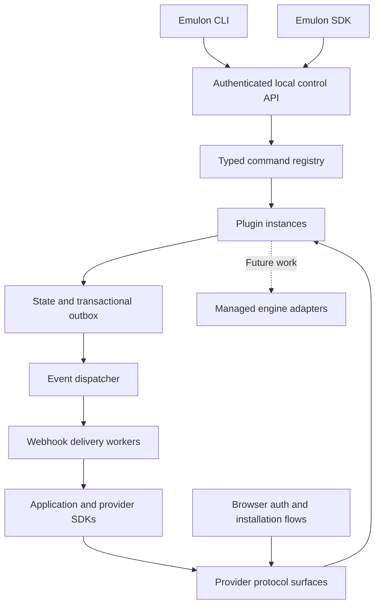
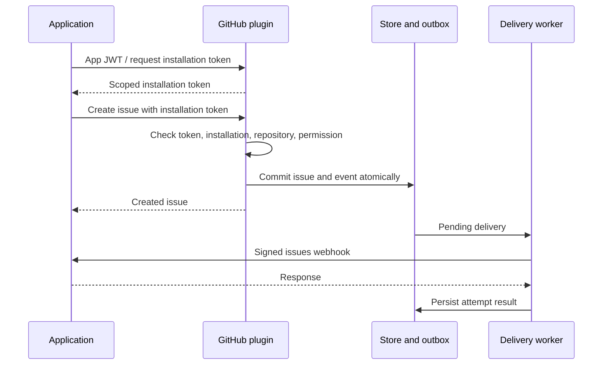

# Emulon: CLI, SDK, and Plugin Architecture

## Purpose and document status

Emulon provides local third-party services for application development and testing. Applications use provider-compatible endpoints and their usual clients. Developers control service state, authentication, events, webhook deliveries, and failure scenarios through both a CLI and a programmatic SDK.

This document is the product specification. Confirmed product decisions are distinguished from proposed implementation choices and unresolved questions. Implementation choices are recorded as ADRs in [docs/decisions](decisions/), and verified behavior is described in the linked documents.

## Confirmed product decisions

- Develop the project in TypeScript using Deno and publish packages to npm.
- Publish the primary CLI, SDK, and plugin authoring API as `emulon`, not `@emulon/core`.
- Publish official plugins in the `@emulon` npm scope.
- Publish Cal.com as the official `@emulon/calcom` plugin.
- Publish Polar as the official `@emulon/polar` plugin.
- Use default exports for plugin factories and configuration. Export core utilities such as `defineConfig` and `definePlugin` by name.
- Resolve simple CLI plugin names through a package naming convention.
- Support API emulators, including Stripe, S3, Resend, Upstash, GitHub, and CRM integrations over time.
- Make plugins straightforward to author using shared infrastructure.
- Treat webhooks and authorization, including GitHub Apps, as first-class functionality.
- Expose service operations, event publication, webhook sending, inspection, and redelivery through the CLI as well as the SDK.

## Goals and boundaries

An application should be able to exercise realistic service behavior locally: create resources, obtain credentials, encounter authorization failures, receive signed webhooks, and recover from transient failures. Tests must be able to start isolated environments and wait for specific outcomes without arbitrary sleeps.

Emulon does not promise complete compatibility with every provider. Each plugin declares the API versions, operations, authentication flows, and behaviors it implements. Unsupported operations fail explicitly and never silently reach the real provider.

Managed engines are deferred: the first version does not implement managed engine support or the Processes facility, and no managed engine plugins are currently provided. The managed engine capability remains reserved in the plugin contract for future work.

Record/proxy mode, remote hosting, and a general management dashboard are deferred. Local authorization and installation pages are part of the initial architecture because browser-based auth flows need them.

## Package and installation model

| Package | Responsibility |
| --- | --- |
| `emulon` | CLI, SDK, plugin definitions, runtime orchestration |
| `@emulon/github` | GitHub API, app authorization, events, and webhooks |
| `@emulon/stripe` | Supported Stripe workflows |
| `@emulon/calcom` | Supported Cal.com API v2 scheduling workflows |
| `@emulon/polar` | Supported Polar customer workflows |
| `@emulon/<service>` | Other official service plugins |

Proposed resolution convention:

| CLI specifier | npm package |
| --- | --- |
| `github` | `@emulon/github` |
| `github@1.2.0` | `@emulon/github@1.2.0` |
| `community:acme` | `emulon-plugin-acme` |
| `@team/acme` | `@team/acme` |
| `@emulon/github` | `@emulon/github` |
| `emulon-plugin-acme` | `emulon-plugin-acme` |

Short unqualified names only resolve to official packages; explicitly named `emulon-plugin-*` packages are accepted as-is. Resolution never falls back to community packages. Package availability and ownership are not established by this document.

`emulon add` resolves and installs a dependency, updates the lockfile through the selected package manager, validates plugin metadata, and adds configuration where safe. Existing instances are preserved. If a configuration cannot be edited safely, the CLI prints the exact import and service entry to add instead of replacing user code.

```sh
npm install -D emulon
npx emulon init
npx emulon add github resend
npx emulon up
```

A plugin's default export is its factory. Metadata identifies the plugin contract version; no named export discovery is needed:

```json
{
  "name": "@emulon/github",
  "emulon": {
    "apiVersion": 1
  },
  "peerDependencies": {
    "emulon": "0.1.0",
    "hono": "4.13.8"
  }
}
```

The dependency range is illustrative. Release compatibility rules must be established before the first published version.

## Configuration and instance identity

```ts
import { defineConfig } from "emulon";
import github from "@emulon/github";
import resend from "@emulon/resend";

export default defineConfig({
  services: {
    github: github({
      fixtures: {
        users: [{ login: "igor" }],
        repositories: [{ owner: "igor", name: "demo", private: true }],
        apps: [{
          slug: "review-bot",
          permissions: { metadata: "read", issues: "write" },
          events: ["issues"],
          callbackUrls: ["http://localhost:3000/auth/github/callback"],
          webhook: {
            url: "http://localhost:3000/webhooks/github",
            secret: "local-webhook-secret",
          },
        }],
      },
    }),
    mail: resend(),
  },
});
```

`github` and `mail` are instance names, not package names. Multiple instances of the same plugin have separate state, credentials, ports, and queues. Core command names are reserved and cannot be used as instance names.

TypeScript configuration is executable trusted project code. Configuration loading, npm dependency resolution, and support for Node and Deno are validated by [distribution verification](distribution.md).

## Runtime and distribution

Proposed implementation: keep business logic and plugin contracts portable across Node and Deno. Use web-standard request/response types and place filesystem, process, server, and persistence access behind runtime adapters. Plugins use the supplied context instead of calling `Deno.serve` or opening storage directly.

Deno >= 2.9 is the development toolchain. The npm distribution targets Node >= 22.13.0 without a separately installed Deno, with verification on active LTS and current releases. See [ADR 0001](decisions/0001-supported-runtimes.md); [distribution verification](distribution.md) records the runtime versions actually exercised.

`deno pack` can create an npm-compatible library archive, including JavaScript and declarations. Its Deno shim covers only a subset of APIs, and its JSR import rewriting can require consumer registry configuration. Therefore the release build must check transitive dependencies and the generated package rather than assume portability. CLI packaging additionally needs a correct executable `bin` entry. The build uses `dnt` because `deno pack` rejected the required unscoped package name; see [ADR 0004](decisions/0004-npm-build-tool.md) for the clean Node installation evidence. [Deno packaging](https://docs.deno.com/runtime/reference/cli/pack/), [dnt](https://deno.com/blog/publish-esm-cjs-module-dnt).

A standalone compiled CLI is a later distribution option. Loading independently installed plugins must be demonstrated before offering it; compilation alone is not a complete plugin distribution design.

## Architecture



The environment owns plugin instances, listeners, storage, clocks, and jobs. Ownership of managed engine child processes is deferred. The CLI is a client of that environment for management operations; invoking a command must not instantiate a second copy of service state.

`emulon up` starts a foreground environment and writes a discovery record containing its identity and connection information. CLI calls use the current project's record, with an explicit environment override for concurrent environments. Stale records are detected through an authenticated identity check. [ADR 0007](decisions/0007-control-api-and-discovery.md) specifies the loopback transport, project discovery record, `--environment` selector, and `Emulon.connect()` options.

`Emulon.start()` creates a private environment and returns a typed client. `Emulon.connect()` attaches to an existing one. Disposing a started environment shuts it down; disposing an attached client only disconnects. Startup uses dynamically allocated ports and rolls back already-started components if any instance fails readiness.

The local control API is separate from provider-facing endpoints, binds to loopback, and requires an environment-specific credential. Browser auth sessions cannot invoke arbitrary management commands. Credentials are not printed in normal status output.

## Plugin contract

A plugin definition declares capabilities, commands, supported provider behavior, and a lifecycle. The following types show the contract shape rather than a complete compilable SDK.

```ts
type Capability =
  | "http" | "managed-engine" | "authorization"
  | "events" | "webhooks" | "reset"
  | "virtual-time" | "snapshot" | "faults";

interface PluginDefinition<Options, Commands> {
  name: string;
  apiVersion: number;
  capabilities: readonly Capability[];
  commands: Commands;
  setup(ctx: PluginContext, options: Options): Promise<PluginInstance>;
  presentation?(options: Options): PluginPresentation;
}

interface PluginPresentation {
  eventView?(event: EventRecord): unknown;
  deliverySnapshot?(event: EventRecord, destination: Destination): Uint8Array;
}

interface PluginInstance {
  endpoints: Record<string, string>;
  ready(): Promise<void>;
  stop(): Promise<void>;
}
```

The optional `presentation` hooks let a plugin show provider views of neutral committed events without core knowing provider versions ([ADR 0036](decisions/0036-stripe-api-version-modules.md)). The host creates them from the instance options before state recovery. `eventView` replaces only the payload returned by event list, follow and CLI output. `deliverySnapshot` runs inside the transaction that enqueues a subscribed or direct delivery; its exact bytes are stored privately with the delivery and sent by every attempt, redelivery and reopened host instead of the transport serializer. Both receive frozen copies, must be deterministic and have no external effects. A shared webhook destination may carry an optional JSON `provider` settings object owned by the plugin; the shared `destinationSchema` command input does not accept it, so plugins that opt in expose their own typed fields. Plugins that omit hooks and settings keep the canonical payload and serializer bytes.

The `managed-engine` capability is retained in this contract for future work; it has no implementation or plugins in the first version.

`definePlugin()` returns the callable factory exported by the package. A factory invocation captures options; environment startup executes `setup()`. A convenience `defineHttpPlugin()` may supply the single-surface lifecycle defaults.

The context provides these host-managed facilities; Processes is deferred and is not implemented in the first version:

| Facility | Contract |
| --- | --- |
| HTTP surfaces | Named Hono applications, bounded bodies, lifecycle middleware and owned listeners |
| Store | Instance isolation, transactions, schema versioning |
| Clock | Current time and scheduled work; virtual time where supported |
| IDs | Reproducible resource IDs under a configured seed |
| Crypto | Real signing, verification, secure token generation |
| Events/outbox | Atomic event recording alongside state mutations |
| Deliveries | Persisted attempts, scheduling, inspection, cancellation |
| Processes (deferred) | Future managed backend startup, readiness, exit observation, cleanup |
| Commands | Shared input/output validation and dispatch |
| Diagnostics | Redacted request, event, and command records |

HTTP plugins call `const api = ctx.http.surface("api")`, register Hono routes
such as `api.get("/emails/:id", (c) => ...)`, and obtain decoded parameters
through `c.req.param("id")`. `await ctx.http.listen("api")` returns the endpoint
URL after registration. Host middleware precedes plugin routes. See
[ADR 0014](decisions/0014-hono-http-layer.md) for limits, lifecycle guarantees,
Node/Deno adapters and dependency packaging.

Resource ID determinism must not imply predictable authorization secrets. Token and key generation uses secure randomness. Test-only key fixtures may be explicitly supplied.

Initially plugins and configuration are trusted code in the host process. Context restrictions are an API discipline, not a security sandbox. Deno permissions do not automatically isolate imported plugins, and subprocess permissions need separate treatment. Process-isolated plugins are deferred. [Deno permissions](https://docs.deno.com/runtime/reference/permissions/).

## One command contract for CLI and SDK

Every public management operation is a declared command. There are no SDK-only management methods hidden inside arbitrary returned objects.

```ts
const createIssue = defineCommand({
  description: "Create an issue and publish the corresponding event",
  input: createIssueInput,
  output: issueOutput,
  cli: {
    path: ["issues", "create"],
    flags: { repo: "repository", title: "title" },
  },
  async execute(ctx, input) {
    return ctx.model.createIssueAndEvent(input);
  },
});
```

Schemas determine validation and inferred SDK types; CLI metadata determines names, descriptions, flags, and file inputs. Command schemas use Zod v4 (`npm:zod@4.6.5`) for type inference and JSON Schema metadata; see [ADR 0002](decisions/0002-schema-library.md). Command inputs and results must have a defined JSON wire representation. Binary content uses explicit file or blob references, not live streams or closures across the control API.

A static command declaration maps `issues.create` to `issues create`; plugin package types retain the concrete registry so SDK calls have typed inputs and outputs. Both frontends dispatch through the same handler and validation. Structured CLI output is available with `--json`; failures use nonzero exit codes and stable machine-readable error codes.

```sh
emulon github apps create --slug review-bot
emulon github installations create --app review-bot --account igor
emulon github issues create --repo igor/demo --title "Bug"
emulon github installations suspend 42
emulon github --help
```

```ts
await env.services.github.issues.create({
  repository: "igor/demo",
  title: "Bug",
});
```

Plugins may throw `DomainError(code, message)`, exported by `emulon`, from command executors to declare a domain failure safe for callers. Only its code and message cross the command boundary; plugin authors must use safe messages without credentials, raw inputs, or underlying exception text. CLI and SDK expose the same error envelope. Unexpected exceptions remain `COMMAND_FAILED` without details. GitHub issue creation reports `REPOSITORY_NOT_FOUND` with fixture configuration guidance when the management command cannot find a repository.

Provider HTTP handlers and management commands share domain operations when their semantics match. Provider endpoints enforce provider authentication. Management commands use control authorization and may explicitly create fixtures or inject scenarios; they do not accidentally inherit a provider token's authority.

## Events and webhooks

Three operations have distinct contracts:

| Operation | State mutation | Recipient selection |
| --- | --- | --- |
| Service action | Changes business state and records resulting events atomically | Plugin subscription rules |
| Event publication | Records a synthetic event; no implied business mutation | Plugin subscription rules |
| Webhook send | Creates an explicit delivery; no implied business mutation | Explicit destination or installation |

```sh
emulon github events publish issues.opened --data ./event.json
emulon github webhooks send issues.opened \
  --data ./event.json --installation 42
emulon github webhooks list
emulon github webhooks inspect delivery_123
emulon github webhooks redeliver delivery_123
emulon github webhooks wait delivery_123 --status succeeded --timeout 10s
emulon events --follow
```

`issues.opened` is an Emulon event key. The GitHub plugin maps it to the provider event name `issues` and payload action `opened`. Inputs are schema-validated; publication does not infer missing provider entities by mutating state. A deliberately malformed delivery is a separate fault scenario.

Emulon implements subscription state and queued materialization as specified in [ADR 0010](decisions/0010-subscriptions-and-dispatch.md). Project hosts persist state across restarts through [ADR 0016](decisions/0016-durable-state.md); independent process-kill delivery proof is documented in [delivery verification](events-and-delivery.md). Sending and attempt recording are implemented as specified in [ADR 0011](decisions/0011-delivery-worker-and-svix.md). Public send, inspect, wait and redelivery commands are implemented as specified in [ADR 0012](decisions/0012-webhook-commands.md).

The outbox commits with domain mutations. The dispatcher materializes durable deliveries using an idempotent `(event, subscription)` key, so restarting it does not create duplicate logical deliveries. Subscription eligibility is captured as part of event processing according to the plugin's declared policy. Destination disablement and credential rotation before sending must be handled explicitly by the provider adapter.

```ts
interface EventRecord {
  id: string;
  instanceId: string;
  type: string;
  occurredAt: string;
  origin: "service" | "published" | "direct";
  payload: unknown;
}

interface DeliveryRecord {
  id: string;
  eventId: string;
  destinationId: string;
  status: "queued" | "in-flight" | "succeeded" | "failed" | "cancelled";
  nextAttemptAt?: string;
}

interface DeliveryAttempt {
  id: string;
  deliveryId: string;
  startedAt: string;
  completedAt?: string;
  responseStatus?: number;
  errorCode?: string;
}
```

The actual schema also retains serialized request bytes, safe header metadata, bounded response content, and the provider delivery identifier. Secrets and authorization headers are redacted from ordinary inspection. When a plugin supplies `deliverySnapshot`, the body is captured when the delivery is enqueued rather than at the first attempt. Redelivery preserves the event body and creates a new attempt; provider adapters define identifier reuse and signature regeneration behavior.

The worker uses a transport adapter to create provider-specific headers and signatures over the exact bytes it sends. Plugins define timeouts, success criteria, and retry schedules. Core supports retries but never imposes them on every provider. GitHub does not automatically redeliver failures, so its default is manual redelivery. [GitHub failure handling](https://docs.github.com/en/webhooks/using-webhooks/handling-failed-webhook-deliveries).

Delivery is not exactly-once. A receiver may process a request before a connection fails. Tests can inject this outcome, duplicated events, delayed deliveries, and changed ordering. [ADR 0013](decisions/0013-delivery-fault-scenarios.md) defines the control command and unknown attempt outcome; [events and delivery verification](events-and-delivery.md) describes scenarios and the delivery recovery verification boundary.

## Authorization and GitHub reference plugin

Authorization belongs to service behavior, not just request middleware. Core supplies reusable crypto, token storage, session handling, and local interaction primitives. Plugins own provider-specific token formats, permissions, routes, responses, and policy.

GitHub exposes separate `api` and `web` endpoints. The application must configure both when testing API access and browser redirects. Changing an environment variable alone does not reconfigure every third-party SDK; each plugin documents supported client setup.

The model contains users, accounts, repositories, app registrations, installations, grants, authorization codes, tokens, and webhook subscriptions. App installation and user authorization are distinct flows.

| Principal | Authentication | Authorization |
| --- | --- | --- |
| GitHub App | App-signed JWT | App-level operations and owned installations |
| Installation | Installation access token | Granted repositories and permissions |
| User through GitHub App | User access token | Intersection of app access and user access |
| OAuth App user | OAuth access token | Separate OAuth application and scope model |

GitHub App JWT verification checks RS256 signatures, issuer identity, and validity times; the expiry may be no more than ten minutes in the future. The installation-token endpoint authenticates the app, checks ownership and installation state, rejects requested privilege expansion, and issues a token with a one-hour lifetime. [JWT requirements](https://docs.github.com/en/apps/creating-github-apps/authenticating-with-a-github-app/generating-a-json-web-token-jwt-for-a-github-app), [installation token requirements](https://docs.github.com/en/apps/creating-github-apps/authenticating-with-a-github-app/generating-an-installation-access-token-for-a-github-app).

Initial reference routes:

```text
API surface
  GET  /app
  GET  /app/installations
  POST /app/installations/:installationId/access_tokens
  GET  /user
  POST /repos/:owner/:repo/issues

Web surface
  GET  /login/oauth/authorize
  POST /login/oauth/access_token
```

Local consent and installation pages select fixture identities and repository grants. Authorization codes are bound to client and callback, expire, and are single-use. The provider returns the supplied `state`; the consuming application is responsible for validating it. Refresh is implemented only for an explicitly declared supported token mode. GitHub App user access is limited by both app and user permissions. [GitHub user authorization](https://docs.github.com/en/apps/creating-github-apps/authenticating-with-a-github-app/generating-a-user-access-token-for-a-github-app).

The browser consent/code half of user authorization is implemented in [ADR 0022](decisions/0022-github-local-consent.md): the environment-owned `web` surface and authenticated `authorization.approve` local extension share issuance. [ADR 0024](decisions/0024-github-user-tokens.md) adds atomic code exchange and non-expiring user access tokens.

The initial GitHub slice supports App JWTs, installation tokens, installation fixtures, issue creation, and signed issue webhooks. User authorization is implemented as a separate slice (ADRs 0022 and 0024). OAuth Apps, PATs, device authorization, and complete browser installation compatibility are not implicitly supported by that first slice.

GitHub deliveries set `X-GitHub-Event`, `X-GitHub-Delivery`, and, when configured, `X-Hub-Signature-256`. The signature is HMAC-SHA256 over the delivered body. [GitHub webhook validation](https://docs.github.com/en/webhooks/using-webhooks/validating-webhook-deliveries).



[ADR 0019](decisions/0019-github-issues.md) specifies the implemented issue command, atomic event recording, and the explicitly local installation-principal `GET /user` extension. CLI/SDK management calls retain control authorization; provider issue requests accept installation tokens or user tokens with intersected app and user grants.

Repository access is checked on each request, including current suspension and grant state. Tokens from another environment or instance must fail. Exact provider error bodies and status codes are validated by contract tests, not replaced with one generic access-denied response.

## State, time, and backend lifecycle

Private environments use an in-memory transactional adapter. [ADR 0016](decisions/0016-durable-state.md) selects built-in SQLite for durable project environments; project hosts now use that adapter and graph codec by default. The concrete store, version and reset contracts are recorded in [ADR 0017](decisions/0017-state-store.md). Transactions must include the outbox; plugins cannot silently substitute non-atomic storage.

Project state lives at the canonical project path `.emulon/state/<environment>/state.sqlite`. Its UUID survives restart; discovery id/token are fresh per run. Down retains state. Renamed instances start fresh, removed instances remain dormant, and re-added instances must match stored plugin identity and versions. Existing instances are never reseeded on startup; current startup fixtures are captured once for explicit reset. When instances are restored, `up` reports a `STATE_RESTORED` notice naming them and explaining how to apply the current startup fixtures with `emulon reset --environment <name>` and the destructive effect of reset. This notice is emitted on every restore, without claiming to detect fixture changes. Stale discovery must still be removed explicitly, and a live database owner cannot be displaced. Shutdown and startup rollback close provider admission and retain database ownership until admitted handlers, commands and workers finish and owned discovery is removed. See [durable state](durable-state.md) for ownership and cleanup.

Environment reset is a barrier: it pauses new commands, provider requests and event observations, drains admitted commands and provider handlers, rejects event reads spanning generations, and interrupts event subscriptions (see [ADR 0026](decisions/0026-reset-observation-barrier.md)). It cancels or drains jobs according to a documented policy, restores fixtures, invalidates prior generated credentials, and resumes processing under a new generation. Durable reset commits all active instances together, preserves dormant instances and storage identity, and disposes the fenced host on failure. Workers cannot commit stale results into the new generation. Already-received external webhooks cannot be undone; reset reports in-flight deliveries whose external outcome is unknown.

Persistent state records plugin version and schema version. Startup rejects plugin identity and exact plugin/schema version mismatches and malformed core queue/attempt records across all configured instances before any fixture, setup, subscription policy or delivery callback; no migration is currently implemented. Snapshot support is capability-gated and, when offered, includes pending work and clock state as well as business entities.

Virtual time controls supported plugin timers and expiry calculations. Network I/O timeouts use real monotonic time. Advancing Emulon's clock does not advance an external SDK's token cache or JWT clock; tests must coordinate both or deliberately exercise expiry responses.

```sh
emulon clock advance 1h
emulon reset
emulon exec -- npm run dev
```

`exec` injects declared connection variables into the child process. It does not guarantee that clients consume those variables. Plugins provide explicit connection recipes.

Managed backend lifecycle is future work, not part of the first version. Any future implementation must declare prerequisites, isolate resources, verify readiness, report crashes, and clean up only owned resources; broad process killing and deletion of arbitrary user databases are prohibited.

## SDK lifecycle example

```ts
import { Emulon } from "emulon";
import github from "@emulon/github";

await using env = await Emulon.start({
  services: {
    github: github({
      fixtures: {
        users: [{ login: "igor" }],
        repositories: [{ owner: "igor", name: "demo", private: true }],
      },
    }),
  },
});

const gh = env.services.github;
const app = await gh.apps.create({ slug: "review-bot" });
const installation = await gh.installations.create({
  appId: app.id,
  account: "igor",
  repositories: ["igor/demo"],
});

// Configure the application with locally provisioned credentials/endpoints.
// It then uses its normal provider client for the protocol under test.
await gh.installations.suspend({ id: installation.id });
```

The GitHub scaffold command shapes, credential output, and fixture boundaries are specified in [ADR 0015](decisions/0015-github-scaffold.md). Like other commands, suspension takes an object input in the SDK; its CLI ID remains positional.

The account and repository fixtures are provisioned before installation. Generated client types preserve command input/output types. `start`, `connect`, stop, reset, and wait operations all have defined ownership and cancellation behavior.

## Data ownership and flow coverage

| Entity | Creation and persistence | Exposure | Lifecycle |
| --- | --- | --- | --- |
| Environment | Host startup and discovery record | CLI status and SDK handle | Owned shutdown and stale-record cleanup |
| Service resource | Domain transaction in instance store | Provider serialization and typed commands | Fixture reset; plugin schema migration |
| App/grant/token | Auth domain and protected store | Provider auth responses; dedicated control commands | Expiry, revocation, suspension, reset |
| Event | Transactional outbox or explicit publication | Event commands and event stream | Retention and dispatcher recovery |
| Delivery | Event recipient selection or explicit send | Webhook commands and SDK | Scheduling, cancellation, redelivery |
| Attempt | Worker transport execution | Bounded, redacted inspection | Completion or unknown outcome after crash |
| Backend resource (deferred) | Future managed process adapter and ownership record | Future health and connection details | Future readiness, stop, owned cleanup |

All persistent entities need environment/instance ownership and schema-version coverage. Management UI projections are not required initially; browser consent pages only read the identity, client, and grant state needed for their flow.

## Errors and observability

| Condition | Management behavior |
| --- | --- |
| Unknown instance or command | Fail before mutation; show available names |
| Invalid input | Stable validation code and field errors |
| Unsupported capability | Explicit unsupported-capability error |
| Plugin contract mismatch | Reject startup with required/actual versions |
| Missing backend prerequisite (deferred) | Future managed engine support must explain dependency and setup path |
| Unknown provider route | Explicit provider-surface unsupported response |
| Provider auth failure | Provider-compatible status/body |
| Failed webhook | Persist attempt; apply provider retry policy |
| Wait timeout | Nonzero CLI exit / SDK timeout with current state |
| Partial startup | Roll back owned resources and report failed instance |

Request logs correlate environment, instance, request, command, event, and delivery IDs. Inspectors expose state and delivery outcomes with bounded retention. Secrets are omitted by default. Explicitly requested local app credentials are available through dedicated authenticated commands.

## Compatibility and verification

Each plugin publishes a compatibility manifest: API versions, routes/operations, auth modes, event types, webhook semantics, and capabilities. Unknown API versions must not silently receive a claimed-compatible response.

The archive checks are available as `deno task verify:dist`; see [distribution verification](distribution.md) and [ADR 0005](decisions/0005-typescript-build-dependency.md) for the offline compiler setup. Each run reports the runtime versions it checks.

Validation must include:

1. Install built npm archives into clean Node and Deno fixtures; verify imports, CLI `bin`, config loading, and plugin resolution without hidden workspace dependencies.
2. Run the same operation through CLI and SDK and compare state, results, errors, and emitted events. The Resend check runs in `deno task check`; see [CLI and SDK parity](parity.md) for its scope and mismatch reproduction.
3. Exercise provider-facing routes through real provider SDKs configured to local endpoints.
4. Verify wrong JWT signatures, expired tokens, cross-installation access, permission narrowing, suspended installations, and reused authorization codes.
5. Verify exact webhook body signatures, failed attempts, explicit redelivery, receiver-side success followed by transport failure, and restart recovery.
6. Test concurrent mutations and transactional outbox recovery across a crash boundary.
7. Start parallel environments; prove separation of state, ports, credentials, and jobs.
8. Test reset during in-flight work, partial startup failures, and owned-resource cleanup.
9. Test CLI event publication and direct webhook sending without unintended business mutations.

Passing local contract tests demonstrates the checked scope, not full provider equivalence. Real-provider comparisons, if added, run in explicit opt-in jobs with dedicated test accounts; ordinary tests remain local.

## Proposed implementation layout

```text
packages/
  emulon/
    src/
      cli/
      sdk/
      control/
      plugins/
      commands/
      state/
      events/
      deliveries/
      runtime/
  github/
    src/
      mod.ts
      model/
      auth/
      commands/
      routes/
      webhooks/
  resend/
examples/
  github-app/
scripts/
  build-npm.ts
docs/
  design.md
```

## Roadmap and implementation decisions

Implemented, in delivery order:

1. Prove distribution: one npm package, one plugin, Node/Deno loading, CLI execution, and typed SDK invocation.
2. Implement isolated environment lifecycle, control API, command schemas, transactional state, and Resend as a small HTTP reference.
3. Implement event publication and explicit signed webhook delivery with inspect, wait, and redelivery commands.
4. Implement the GitHub App installation slice and official-client contract tests.
5. Add GitHub browser user authorization.
6. Implement the bounded Stripe and Cal.com slices in [ADR 0029](decisions/0029-stripe-initial-slice.md) and [ADR 0030](decisions/0030-calcom-initial-slice.md), using the shared compatibility manifest in [ADR 0028](decisions/0028-compatibility-manifest.md). [ADR 0031](decisions/0031-stripe-calcom-implementation-order.md) defines the implementation order and shared mechanics.
7. Implement the bounded Polar customer and signed-delivery slice in [ADR 0033](decisions/0033-polar-initial-slice.md).
8. Extend Stripe to catalog, discounts, hosted Checkout, refunds and disputes in [ADR 0035](decisions/0035-stripe-checkout-and-payments.md).

Future work: S3, Upstash and CRM plugins.

Implementation decisions and their status:

- npm build tooling and CLI packaging are selected in [ADR 0004](decisions/0004-npm-build-tool.md); runtime targets are settled in [ADR 0001](decisions/0001-supported-runtimes.md), and the consumer runtime versions verified so far are recorded in [distribution verification](distribution.md).
- Command schema integration for SDK types and CLI metadata (Zod v4 is selected in [ADR 0002](decisions/0002-schema-library.md)).
- Durable storage uses built-in SQLite as selected in [ADR 0016](decisions/0016-durable-state.md); host lifecycle integration is implemented; independent process-kill recovery tests are described in [delivery verification](events-and-delivery.md). Version mismatches are rejected; migrations remain future work.
- Configuration loader is selected in [ADR 0003](decisions/0003-config-loader.md); package-manager selection and safe `add` configuration edits are selected in [ADR 0032](decisions/0032-plugin-add.md).
- Exact initial provider API versions and operation coverage are selected in [ADR 0028](decisions/0028-compatibility-manifest.md), [ADR 0029](decisions/0029-stripe-initial-slice.md), [ADR 0030](decisions/0030-calcom-initial-slice.md), [ADR 0033](decisions/0033-polar-initial-slice.md), and [ADR 0035](decisions/0035-stripe-checkout-and-payments.md). These are implementation targets; only tested entries ship as supported.

These do not change the confirmed product decisions. Remaining open items, such as storage migrations, should be settled before a broad plugin rollout.

## Sources

The following official documentation was consulted while writing this design. Links support external protocol/tool claims; Emulon's APIs remain proposals.

- [Deno pack](https://docs.deno.com/runtime/reference/cli/pack/) — npm archives, declarations, import rewriting, and shim limitations.
- [dnt](https://deno.com/blog/publish-esm-cjs-module-dnt) — alternative Deno-to-npm build tooling.
- [Deno permissions](https://docs.deno.com/runtime/reference/permissions/) — permission and subprocess boundaries.
- [GitHub App JWT](https://docs.github.com/en/apps/creating-github-apps/authenticating-with-a-github-app/generating-a-json-web-token-jwt-for-a-github-app) — signing and claims.
- [GitHub installation tokens](https://docs.github.com/en/apps/creating-github-apps/authenticating-with-a-github-app/generating-an-installation-access-token-for-a-github-app) — issuance, scope narrowing, and lifetime.
- [GitHub user authorization](https://docs.github.com/en/apps/creating-github-apps/authenticating-with-a-github-app/generating-a-user-access-token-for-a-github-app) — user token flow and access intersection.
- [GitHub webhook validation](https://docs.github.com/en/webhooks/using-webhooks/validating-webhook-deliveries) — signatures.
- [GitHub failed deliveries](https://docs.github.com/en/webhooks/using-webhooks/handling-failed-webhook-deliveries) — manual recovery behavior.
